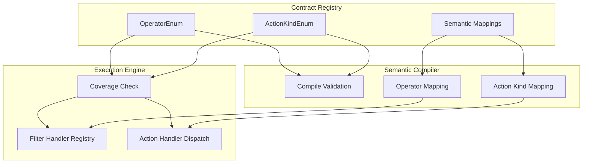
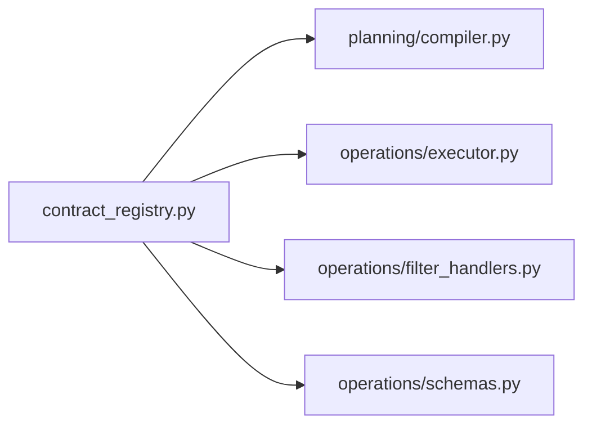

# Design Document: Compiler-Executor Contract

## Overview

This design introduces a **Contract Registry** module that serves as the single source of truth for all canonical operators and action kinds shared between the FinFlow semantic compiler and the execution engine. The registry eliminates implicit string-based coupling by:

1. Defining Python `Enum` classes for operators and action kinds
2. Co-locating semantic-to-canonical mapping metadata alongside each enum member
3. Enforcing compile-time validation (compiler output) and import-time validation (executor handler coverage)

The current system relies on implicit string contracts — the compiler emits operator strings like `"eq"` or action kind strings like `"filter_rows"` that the executor must independently handle. This has caused silent-failure bugs (e.g., `in_` mapped to `eq` instead of `in`). The contract layer makes such bugs structurally impossible.

### Design Rationale

The design follows a **"make illegal states unrepresentable"** philosophy. Rather than adding runtime assertions as an afterthought, we restructure the type system so that:
- The compiler cannot emit a token the executor doesn't know about
- The executor cannot miss handling a token the compiler might emit
- Adding a new operator/action kind follows a single guided registration path

## Architecture



### Module Placement

The contract registry will be a new module at:
```
src/finflow_agent/contract_registry.py
```

This location is at the package root level (alongside `registry.py`) so both `planning/compiler.py` (the semantic compiler) and `operations/executor.py` (the execution engine) can import it without circular dependencies.

### Dependency Flow



The contract registry has **zero internal dependencies** — it imports only from the Python standard library and Pydantic. This ensures it can be imported by any module without circular import risks.

### Design Clarifications

1. **Co-location reduces drift but does not make it impossible.** Co-locating vocabulary and normalization mappings reduces drift, while compile-time validation, executor coverage checks, and contract tests detect remaining inconsistencies. Drift remains possible when the compiler bypasses the mapping, a handler is registered under the wrong token, or deprecated values remain accepted by one side.

2. **Handler coverage is necessary but not sufficient for semantic correctness.** The coverage check proves every action has a handler, but does not prove the handler accepts the correct payload type or implements intended behaviour. The design mitigates this through property-based tests (Property 6) that validate handler output shape.

3. **Bidirectional coverage checking.** The executor coverage check validates both directions — missing handlers AND unknown/excess handlers — to prevent stale registrations from accumulating.

4. **Future extensibility.** The initial implementation uses a single `contract_registry.py` module. If the contract grows to include versioning, payload-model mappings, and operator-per-action-kind constraints, it should be refactored into a dependency-free `contracts/` package.

## Components and Interfaces

### 1. Contract Registry Module (`contract_registry.py`)

#### CanonicalOperator Enum

```python
from enum import Enum
from typing import Dict, Optional


class CanonicalOperator(str, Enum):
    """All valid canonical filter operators.
    
    Each member's value is the string token used in serialized canonical intents.
    Using str mixin ensures JSON serialization produces the string value directly.
    """
    EQ = "eq"
    NEQ = "neq"
    GT = "gt"
    GTE = "gte"
    LT = "lt"
    LTE = "lte"
    CONTAINS = "contains"
    NOT_CONTAINS = "not_contains"
    STARTS_WITH = "starts_with"
    ENDS_WITH = "ends_with"
    BETWEEN = "between"
    IN = "in"
    NOT_IN = "not_in"
    IS_NULL = "is_null"
    IS_NOT_NULL = "is_not_null"
```

Design decision: Using `str, Enum` mixin so that `CanonicalOperator.EQ == "eq"` evaluates to `True` and JSON serialization of models containing enum members produces the string value directly. This maintains backward compatibility with stored canonical intents without any custom serializer.

#### ActionKind Enum

```python
class ActionKind(str, Enum):
    """All valid canonical action kinds.
    
    Each member's value is the string token used in serialized canonical intents.
    """
    CLEAN = "clean"
    PROJECT_COLUMNS = "project_columns"
    DROP_COLUMNS = "drop_columns"
    RENAME_COLUMNS = "rename_columns"
    FILTER_ROWS = "filter_rows"
    SORT_ROWS = "sort_rows"
    LIMIT_ROWS = "limit_rows"
    CALCULATE = "calculate"
    VISUALIZE = "visualize"
    REPORT = "report"
```

#### Semantic Mapping Registry

```python
# Maps semantic relation operator strings to canonical operators.
# This is the single place where semantic-to-canonical operator mapping is defined.
SEMANTIC_RELATION_TO_OPERATOR: Dict[str, CanonicalOperator] = {
    "eq": CanonicalOperator.EQ,
    "neq": CanonicalOperator.NEQ,
    "gt": CanonicalOperator.GT,
    "gte": CanonicalOperator.GTE,
    "lt": CanonicalOperator.LT,
    "lte": CanonicalOperator.LTE,
    "contains": CanonicalOperator.CONTAINS,
    "not_contains": CanonicalOperator.NOT_CONTAINS,
    "starts_with": CanonicalOperator.STARTS_WITH,
    "ends_with": CanonicalOperator.ENDS_WITH,
    "between": CanonicalOperator.BETWEEN,
    "in": CanonicalOperator.IN,
    "not_in": CanonicalOperator.NOT_IN,
    "is_null": CanonicalOperator.IS_NULL,
    "is_not_null": CanonicalOperator.IS_NOT_NULL,
}

# Maps semantic operation type strings to canonical action kinds.
SEMANTIC_OPERATION_TO_ACTION_KIND: Dict[str, ActionKind] = {
    "clean": ActionKind.CLEAN,
    "project_columns": ActionKind.PROJECT_COLUMNS,
    "drop_columns": ActionKind.DROP_COLUMNS,
    "rename_columns": ActionKind.RENAME_COLUMNS,
    "filter_rows": ActionKind.FILTER_ROWS,
    "sort_rows": ActionKind.SORT_ROWS,
    "limit_rows": ActionKind.LIMIT_ROWS,
    "calculate": ActionKind.CALCULATE,
    "visualize": ActionKind.VISUALIZE,
    "report": ActionKind.REPORT,
}
```

#### Validation Functions

```python
class ContractViolationError(Exception):
    """Base class for contract violations."""
    pass


class InvalidOperatorError(ContractViolationError):
    """Raised when an operator string is not in CanonicalOperator."""
    pass


class InvalidActionKindError(ContractViolationError):
    """Raised when an action kind string is not in ActionKind."""
    pass


class UnmappedSemanticTypeError(ContractViolationError):
    """Raised when a semantic type has no canonical mapping."""
    pass


def validate_operator(operator: str) -> CanonicalOperator:
    """Validate and return the canonical operator for a string token.
    
    Raises InvalidOperatorError with the invalid value and valid options if not found.
    """
    try:
        return CanonicalOperator(operator)
    except ValueError:
        valid = [op.value for op in CanonicalOperator]
        raise InvalidOperatorError(
            f"Invalid canonical operator: {operator!r}. "
            f"Valid operators: {valid}"
        )


def validate_action_kind(kind: str) -> ActionKind:
    """Validate and return the canonical action kind for a string token.
    
    Raises InvalidActionKindError with the invalid value and valid options if not found.
    """
    try:
        return ActionKind(kind)
    except ValueError:
        valid = [ak.value for ak in ActionKind]
        raise InvalidActionKindError(
            f"Invalid canonical action kind: {kind!r}. "
            f"Valid action kinds: {valid}"
        )


def resolve_semantic_operator(relation_operator: str) -> CanonicalOperator:
    """Map a semantic relation operator to its canonical operator.
    
    Raises UnmappedSemanticTypeError if no mapping exists.
    """
    result = SEMANTIC_RELATION_TO_OPERATOR.get(relation_operator)
    if result is None:
        raise UnmappedSemanticTypeError(
            f"Unmapped semantic relation operator: {relation_operator!r}. "
            f"Add a registration entry in SEMANTIC_RELATION_TO_OPERATOR in contract_registry.py."
        )
    return result


def resolve_semantic_operation_type(operation_type: str) -> ActionKind:
    """Map a semantic operation type to its canonical action kind.
    
    Raises UnmappedSemanticTypeError if no mapping exists.
    """
    result = SEMANTIC_OPERATION_TO_ACTION_KIND.get(operation_type)
    if result is None:
        raise UnmappedSemanticTypeError(
            f"Unmapped semantic operation type: {operation_type!r}. "
            f"Add a registration entry in SEMANTIC_OPERATION_TO_ACTION_KIND in contract_registry.py."
        )
    return result
```

#### Coverage Check Functions

```python
def check_operator_handler_coverage(handler_registry: Dict[str, Any]) -> None:
    """Verify every CanonicalOperator has a handler and no unknown handlers exist.
    
    Called at module import time by the execution engine.
    Raises ImportError identifying any unhandled or unknown operators.
    """
    enum_values = {op.value for op in CanonicalOperator}
    handler_values = set(handler_registry.keys())
    
    missing = enum_values - handler_values
    unknown = handler_values - enum_values
    
    errors = []
    if missing:
        errors.append(
            f"Filter handler registry is missing handlers for operators: {sorted(missing)}. "
            f"Add handler functions for these operators in filter_handlers.py."
        )
    if unknown:
        errors.append(
            f"Filter handler registry contains unknown operators: {sorted(unknown)}. "
            f"Remove them or add corresponding enum members to CanonicalOperator."
        )
    if errors:
        raise ImportError(" ".join(errors))


def check_action_kind_coverage(action_handler_registry: Dict[str, Any]) -> None:
    """Verify every ActionKind has an execution path and no unknown handlers exist.
    
    Called at module import time by the execution engine.
    Raises ImportError identifying any unhandled or unknown action kinds.
    """
    enum_values = {ak.value for ak in ActionKind}
    handler_values = set(action_handler_registry.keys())
    
    missing = enum_values - handler_values
    unknown = handler_values - enum_values
    
    errors = []
    if missing:
        errors.append(
            f"Action handler registry is missing execution paths for: {sorted(missing)}. "
            f"Add handler functions for these action kinds in the executor module."
        )
    if unknown:
        errors.append(
            f"Action handler registry contains unknown action kinds: {sorted(unknown)}. "
            f"Remove them or add corresponding enum members to ActionKind."
        )
    if errors:
        raise ImportError(" ".join(errors))
```

### 2. Compiler Integration

The semantic compiler (`planning/compiler.py`) will be modified to:

1. Import `validate_operator`, `validate_action_kind`, `resolve_semantic_operator` from `contract_registry`
2. Replace hardcoded operator string comparisons with enum-based validation
3. Call `validate_operator()` on every operator token before emitting a filter condition
4. Call `validate_action_kind()` on every action kind before emitting an action
5. Wrap validation errors as `SemanticCompilationError` for backward-compatible exception handling

```python
# In compiler.py — validation wrapper
from finflow_agent.contract_registry import (
    validate_operator,
    validate_action_kind,
    InvalidOperatorError,
    InvalidActionKindError,
)

def _validated_operator(operator: str) -> str:
    """Validate operator against contract registry, raise SemanticCompilationError on failure."""
    try:
        return validate_operator(operator).value
    except InvalidOperatorError as e:
        raise SemanticCompilationError(str(e)) from e

def _validated_action_kind(kind: str) -> str:
    """Validate action kind against contract registry, raise SemanticCompilationError on failure."""
    try:
        return validate_action_kind(kind).value
    except InvalidActionKindError as e:
        raise SemanticCompilationError(str(e)) from e
```

### 3. Executor Integration

The execution engine (`operations/executor.py` and `operations/filter_handlers.py`) will be modified to:

1. Import coverage check functions from `contract_registry`
2. Call `check_operator_handler_coverage(FILTER_HANDLERS)` at module level in `filter_handlers.py`
3. Create an `ACTION_HANDLERS` registry dict and call `check_action_kind_coverage(ACTION_HANDLERS)` at module level in `executor.py`

```python
# At the bottom of filter_handlers.py (after FILTER_HANDLERS dict is defined)
from finflow_agent.contract_registry import check_operator_handler_coverage
check_operator_handler_coverage(FILTER_HANDLERS)

# In executor.py — action kind dispatch registry
from finflow_agent.contract_registry import check_action_kind_coverage

ACTION_HANDLERS = {
    "clean": execute_cleaning_plan,
    "filter_rows": execute_filter_plan,
    "calculate": execute_calculation_plan,
    "visualize": execute_visualization_plan,
    "report": execute_reporting_plan,
    "project_columns": execute_project_columns_plan,
    "drop_columns": execute_drop_columns_plan,
    "rename_columns": execute_rename_columns_plan,
    "sort_rows": execute_sort_rows_plan,
    "limit_rows": execute_limit_rows_plan,
}

check_action_kind_coverage(ACTION_HANDLERS)
```

### 4. Schema Integration

The `FilterCondition` model in `operations/schemas.py` will be updated to use the enum instead of a hardcoded `Literal` type:

```python
from finflow_agent.contract_registry import CanonicalOperator

class FilterCondition(BaseModel):
    column: str
    operator: CanonicalOperator  # Was: Literal["eq", "neq", ...]
    value: Optional[Any] = None
    value_to: Optional[Any] = None
    case_sensitive: bool = False
```

Since `CanonicalOperator` is a `str` subclass, Pydantic will accept both raw strings and enum members, maintaining backward compatibility with stored JSON payloads.

## Data Models

### Existing Models (Modified)

| Model | Module | Change |
|-------|--------|--------|
| `FilterCondition` (operations) | `operations/schemas.py` | `operator` field type changes from `Literal[...]` to `CanonicalOperator` |
| `FilterCondition` (canonical) | `planning/canonical_intent.py` | `operator` field type changes from `Literal[...]` to `CanonicalOperator` |
| `IntentAction` subtypes | `planning/canonical_intent.py` | `kind` literals remain unchanged (enum values match) |

### New Models

| Model | Module | Purpose |
|-------|--------|---------|
| `CanonicalOperator` | `contract_registry.py` | Enum of all valid filter operators |
| `ActionKind` | `contract_registry.py` | Enum of all valid action kinds |
| `ContractViolationError` | `contract_registry.py` | Base exception for contract violations |
| `InvalidOperatorError` | `contract_registry.py` | Exception for invalid operator tokens |
| `InvalidActionKindError` | `contract_registry.py` | Exception for invalid action kind tokens |
| `UnmappedSemanticTypeError` | `contract_registry.py` | Exception for unmapped semantic types |

### Serialization Behavior

Because both enums use the `str` mixin pattern (`class CanonicalOperator(str, Enum)`):

- **Serialization**: Pydantic's `.model_dump(mode="json")` produces the string value (e.g., `"eq"` not `"CanonicalOperator.EQ"`)
- **Deserialization**: Pydantic accepts raw strings like `"eq"` and converts them to the enum member
- **Equality**: `CanonicalOperator.EQ == "eq"` is `True` due to `str` inheritance
- **Dict lookup**: `FILTER_HANDLERS[CanonicalOperator.EQ]` works because `str` mixin makes the enum hashable as its string value

This ensures zero breaking changes to stored canonical intents in the database.

## Correctness Properties

*A property is a characteristic or behavior that should hold true across all valid executions of a system — essentially, a formal statement about what the system should do. Properties serve as the bridge between human-readable specifications and machine-verifiable correctness guarantees.*

### Property 1: Operator validation accepts all valid and rejects all invalid tokens

*For any* string `s`, if `s` is a member value of `CanonicalOperator`, then `validate_operator(s)` SHALL return the corresponding enum member; otherwise it SHALL raise `InvalidOperatorError`. The same property applies symmetrically to `validate_action_kind` and `ActionKind`.

**Validates: Requirements 3.1, 3.2**

### Property 2: Invalid operator errors are descriptive

*For any* string `s` that is NOT a member value of `CanonicalOperator`, the `InvalidOperatorError` raised by `validate_operator(s)` SHALL contain both the invalid value `s` and the complete list of valid operator values from the enum.

**Validates: Requirements 3.3, 3.4, 9.2, 9.3**

### Property 3: Semantic-to-canonical operator mapping coverage

*For any* relation operator key `r` present in `SEMANTIC_RELATION_TO_OPERATOR`, `resolve_semantic_operator(r)` SHALL return a value that is a valid member of `CanonicalOperator`.

**Validates: Requirements 7.3**

### Property 4: Semantic-to-canonical action kind mapping coverage

*For any* semantic operation type key `t` present in `SEMANTIC_OPERATION_TO_ACTION_KIND`, `resolve_semantic_operation_type(t)` SHALL return a value that is a valid member of `ActionKind`.

**Validates: Requirements 7.4, 6.1**

### Property 5: Unmapped semantic types produce descriptive errors

*For any* string `t` that is NOT a key in `SEMANTIC_OPERATION_TO_ACTION_KIND`, `resolve_semantic_operation_type(t)` SHALL raise `UnmappedSemanticTypeError` containing the value `t` and a suggestion to add a registration entry.

**Validates: Requirements 6.3, 9.4**

### Property 6: All registered operators produce valid boolean masks

*For any* operator `op` in `CanonicalOperator` and *for any* compatible pandas Series `s` and filter condition with that operator, the corresponding handler in `FILTER_HANDLERS` SHALL produce a `pd.Series` of boolean dtype with length equal to `len(s)`.

**Validates: Requirements 7.1**

### Property 7: Enum serialization round-trip

*For any* `CanonicalOperator` member `op`, serializing a Pydantic model containing `op` to JSON and deserializing it back SHALL produce the same enum member. Equivalently: `CanonicalOperator(op.value) == op` for all members.

**Validates: Requirements 8.3, 8.4**

## Error Handling

### Error Hierarchy

```
ContractViolationError (base)
├── InvalidOperatorError        — raised by validate_operator()
├── InvalidActionKindError      — raised by validate_action_kind()
└── UnmappedSemanticTypeError   — raised by resolve_semantic_*()

ImportError                     — raised by coverage checks at import time
SemanticCompilationError        — existing error, wraps contract violations in compiler
```

### Error Message Format

All error messages follow a consistent structure:
1. **What went wrong**: Identifies the specific invalid value
2. **What was expected**: Lists valid options or the expected format
3. **How to fix it** (where applicable): Points to the registration location

Examples:
```
InvalidOperatorError: Invalid canonical operator: 'in_'. Valid operators: ['eq', 'neq', 'gt', ...]

UnmappedSemanticTypeError: Unmapped semantic operation type: 'pivot'. Add a registration entry in SEMANTIC_OPERATION_TO_ACTION_KIND in contract_registry.py.

ImportError: Filter handler registry is missing handlers for operators: ['new_op']. Add handler functions for these operators in filter_handlers.py.
```

### Failure Modes

| Failure | When | Behavior |
|---------|------|----------|
| Compiler emits invalid operator | Compile time | `SemanticCompilationError` with valid options list |
| Compiler emits invalid action kind | Compile time | `SemanticCompilationError` with valid options list |
| Executor missing handler | Module import time | `ImportError` identifying missing handlers |
| Unknown semantic type | Compile time | `SemanticCompilationError` with registration suggestion |
| Stored intent with old string values | Deserialization | Accepted (str enum compatibility) |

## Testing Strategy

### Property-Based Testing

This feature is well-suited for property-based testing because:
- The contract registry defines pure validation functions with clear input/output behavior
- Universal properties must hold across all enum members and all invalid inputs
- The input spaces (arbitrary strings, enum members) are well-defined and easily generated

**Library**: [Hypothesis](https://hypothesis.readthedocs.io/) (Python property-based testing)

**Configuration**:
- Minimum 100 iterations per property test
- Each property test tagged with: `Feature: compiler-executor-contract, Property {N}: {description}`

### Test Structure

```
tests/
├── test_contract_registry.py          # Property tests for registry validation
├── test_compiler_contract.py          # Integration tests for compiler validation
├── test_executor_coverage.py          # Import-time coverage check tests
└── test_backward_compatibility.py     # Round-trip serialization tests
```

### Unit Tests (Example-Based)

- Verify `CanonicalOperator` contains all 15 required operators (Req 1.4)
- Verify `ActionKind` contains all 10 required action kinds (Req 2.3)
- Verify coverage check raises `ImportError` with specific member name when handler is missing (Req 4.3, 4.4)
- Verify backward-compatible string values match current constants (Req 8.1, 8.2)
- Verify import-time check passes when all handlers are present (Req 4.1, 4.2)

### Property Tests (Hypothesis-Based)

Each correctness property from the design maps to a single Hypothesis test:

1. **Property 1**: Generate arbitrary strings via `st.text()`. If the string is in `{op.value for op in CanonicalOperator}`, assert validation returns the member; otherwise assert `InvalidOperatorError` is raised.
2. **Property 2**: Generate strings NOT in the valid set. Assert the error message contains both the invalid string and valid options.
3. **Property 3**: For each key in `SEMANTIC_RELATION_TO_OPERATOR`, assert the resolved value `isinstance(result, CanonicalOperator)`.
4. **Property 4**: For each key in `SEMANTIC_OPERATION_TO_ACTION_KIND`, assert the resolved value `isinstance(result, ActionKind)`.
5. **Property 5**: Generate strings NOT in `SEMANTIC_OPERATION_TO_ACTION_KIND`. Assert error contains the string and "registration" suggestion.
6. **Property 6**: Generate operator from `CanonicalOperator`, generate compatible Series via Hypothesis pandas strategies, assert handler output is bool Series of correct length.
7. **Property 7**: For each enum member, round-trip through Pydantic JSON serialization and assert equality.

### Integration Tests

- End-to-end test: compile a canonical intent, execute it, verify no contract violations
- Backward compatibility: load stored canonical intents from fixtures, verify deserialization succeeds
- Coverage check: dynamically add an enum member, verify `ImportError` is raised before handler is added
