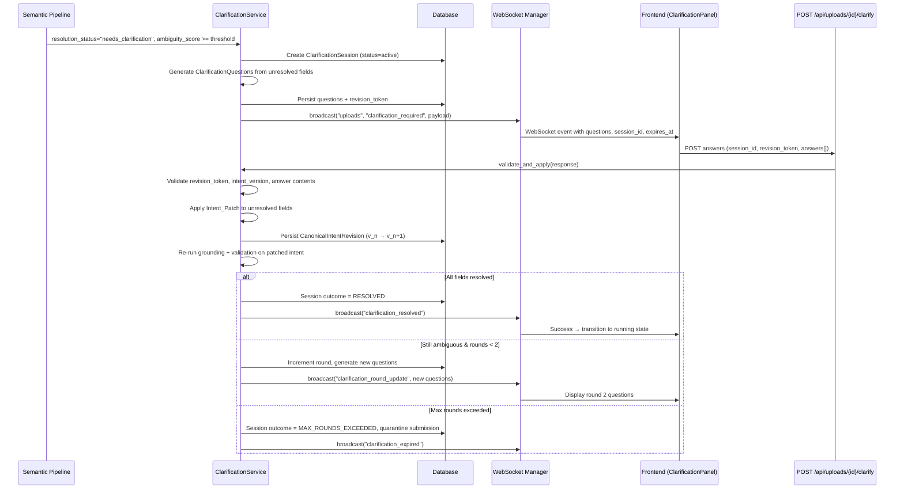
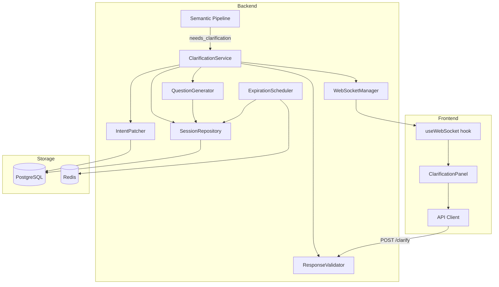

# Design Document: Interactive Ambiguity Resolution

## Overview

This design specifies the interactive ambiguity resolution subsystem for FinFlow. When the semantic pipeline detects resolvable ambiguities in a user prompt (unresolved column references, unclear projections, ambiguous filter targets), the system creates a stateful clarification session, generates structured questions targeting unresolved intent paths, delivers them in real-time via WebSocket, and patches the existing CanonicalIntent with user answers — avoiding full intent regeneration and preserving prior grounding work.

The subsystem integrates with the existing `semantic_pipeline`, `IntentPackage.patch_column()`, `WebSocketManager.broadcast()`, and the FastAPI backend. It introduces new backend modules for session management, question generation, response validation, and intent patching, plus a frontend `ClarificationPanel` React component and new WebSocket event types.

### Key Design Decisions

1. **Selective patching over full regeneration** — Only unresolved fields are re-processed. Extraction and normalization are skipped during re-grounding, reducing latency and preserving grounded context.
2. **Optimistic concurrency via Revision Tokens** — Each question batch issues a cryptographically random token. Stale responses are rejected before touching intent state.
3. **Round-based limits with validation bypass** — Semantic rounds are capped at 2, but invalid responses (validation failures) do not consume rounds, giving users unlimited retries for typos.
4. **Session expiration with periodic cleanup** — Sessions expire after a configurable timeout (default 30 min). A background task garbage-collects abandoned sessions to prevent queue blockage.

## Architecture



### Component Interaction Diagram



## Components and Interfaces

### 1. ClarificationService (`backend/app/services/clarification_service.py`)

The central orchestrator for clarification workflows.

```python
class ClarificationService:
    """Coordinates session creation, question generation, response handling, and outcome routing."""

    async def initiate_session(
        self,
        submission_id: UUID,
        intent: CanonicalIntent,
        intent_package: IntentPackage,
        ambiguity_score: float,
    ) -> ClarificationSession:
        """Create a session, generate questions, broadcast via WebSocket."""
        ...

    async def handle_response(
        self,
        submission_id: UUID,
        response: ClarificationResponsePayload,
    ) -> ClarificationOutcomeResult:
        """Validate, patch intent, re-ground, determine outcome."""
        ...

    async def expire_session(self, session_id: UUID) -> None:
        """Transition session to expired, quarantine submission."""
        ...
```

### 2. QuestionGenerator (`backend/app/services/clarification_questions.py`)

Generates structured `ClarificationQuestion` objects from unresolved fields.

```python
class QuestionGenerator:
    def generate(
        self,
        unresolved_fields: list[UnresolvedField],
        intent_package: IntentPackage,
        intent: CanonicalIntent,
    ) -> list[ClarificationQuestion]:
        """Produce one question per unresolved field with candidate options."""
        ...
```

**Question text strategy by reason code:**
- `MULTIPLE_COLUMN_MATCHES` — Present candidates ordered by confidence; question text only lists options without describing the column matching algorithm.
- `AMBIGUOUS_REFERENCE` — Describe the ambiguity and present competing interpretations.
- `LOW_CONFIDENCE_SCORE` — Ask "Which column did you mean by '{raw_reference}'?" with top candidates.
- `MISSING_COLUMN` — Ask user to provide the correct column name via free text.
- `CONFLICTING_EVIDENCE` — Describe the conflict and ask user to disambiguate.

### 3. ResponseValidator (`backend/app/services/clarification_validator.py`)

Validates user answers before patching.

```python
class ResponseValidator:
    def validate(
        self,
        session: ClarificationSession,
        response: ClarificationResponsePayload,
    ) -> ValidationResult:
        """
        Returns ValidationResult with is_valid flag and per-question error_details.
        Checks: revision_token, intent_version, question ownership, option validity,
        none_of_these + free_text presence.
        """
        ...
```

### 4. IntentPatcher (`backend/app/services/intent_patcher.py`)

Applies selective modifications to the CanonicalIntent.

```python
class IntentPatcher:
    async def apply_patch(
        self,
        intent: CanonicalIntent,
        intent_package: IntentPackage,
        answers: list[ClarificationAnswer],
    ) -> PatchResult:
        """
        Patch unresolved fields, increment revision, compute hash,
        persist CanonicalIntentRevision, re-run grounding.
        Returns PatchResult with new intent, remaining unresolved fields, conflict flag.
        """
        ...
```

### 5. SessionRepository (`backend/app/services/clarification_session_repo.py`)

Database operations for clarification sessions.

```python
class SessionRepository:
    async def create(self, session: ClarificationSession) -> ClarificationSession: ...
    async def get_active_by_submission(self, submission_id: UUID) -> Optional[ClarificationSession]: ...
    async def update(self, session: ClarificationSession) -> None: ...
    async def get_expired_sessions(self) -> list[ClarificationSession]: ...
    async def record_round(self, session_id: UUID, questions: list, answers: list, outcome: str) -> None: ...
```

### 6. ClarificationRouter (`backend/app/api/clarification.py`)

FastAPI router exposing the clarification endpoint.

```python
router = APIRouter(prefix="/uploads", tags=["clarification"])

@router.post("/{submission_id}/clarify", response_model=ClarificationOutcomeResponse)
async def submit_clarification(
    submission_id: UUID,
    payload: ClarificationResponsePayload,
    db: AsyncSession = Depends(get_db),
    user: User = Depends(require_roles(UserRole.user, UserRole.admin)),
) -> ClarificationOutcomeResponse:
    ...
```

### 7. ExpirationScheduler (`backend/app/services/clarification_expiration.py`)

Periodic background task for session cleanup.

```python
class ExpirationScheduler:
    async def run_cleanup(self) -> int:
        """Find expired sessions, quarantine their submissions, broadcast events.
        Returns count of expired sessions processed."""
        ...
```

### 8. Frontend: ClarificationPanel (`frontend/src/components/ClarificationPanel.tsx`)

React component rendered when submission status is "awaiting_clarification".

```typescript
interface ClarificationPanelProps {
  submissionId: string;
  sessionId: string;
  questions: ClarificationQuestion[];
  roundCount: number;
  maxRounds: number;
  expiresAt: string; // ISO timestamp
  revisionToken: string;
  intentVersion: number;
}
```

**Accessibility:** All interactive elements carry ARIA labels. Radio groups for candidate options, free-text input with `aria-describedby` for error messages, keyboard navigation via arrow keys within option groups.

## Data Models

### ClarificationSession (Database Table)

| Column | Type | Description |
|--------|------|-------------|
| id | UUID (PK) | Session identifier |
| submission_id | UUID (FK → submissions) | Associated submission |
| intent_version | INT | Current intent revision at session start |
| round_count | INT | Semantic rounds consumed (0, 1, or 2) |
| max_rounds | INT | Limit (default 2) |
| status | ENUM | `active`, `resolved`, `expired`, `max_rounds_exceeded` |
| revision_token | VARCHAR(64) | Current active token (regenerated each round) |
| expires_at | TIMESTAMPTZ | Absolute expiration time |
| created_at | TIMESTAMPTZ | Session creation time |
| updated_at | TIMESTAMPTZ | Last modification |
| outcome | ENUM (nullable) | Final `ClarificationOutcome` value |

### ClarificationQuestion (Database Table)

| Column | Type | Description |
|--------|------|-------------|
| id | UUID (PK) | Question identifier |
| session_id | UUID (FK → clarification_sessions) | Parent session |
| round_number | INT | Which round this question belongs to |
| intent_path | TEXT | JSON-path to unresolved field (e.g., `actions[1].conditions[0].field.raw_reference`) |
| reason_code | ENUM | `MULTIPLE_COLUMN_MATCHES`, `AMBIGUOUS_REFERENCE`, `LOW_CONFIDENCE_SCORE`, `MISSING_COLUMN`, `CONFLICTING_EVIDENCE` |
| question_text | TEXT | Human-readable question |
| candidate_options | JSONB | Array of candidate strings (includes "none_of_these") |
| free_text_enabled | BOOLEAN | Always true per requirements |
| user_answer | JSONB (nullable) | `{selected_option, free_text}` after response |

### ClarificationOutcome (Enum)

```python
class ClarificationOutcome(str, Enum):
    RESOLVED = "RESOLVED"
    STILL_AMBIGUOUS = "STILL_AMBIGUOUS"
    INVALID_RESPONSE = "INVALID_RESPONSE"
    CONFLICT_INTRODUCED = "CONFLICT_INTRODUCED"
    MAX_ROUNDS_EXCEEDED = "MAX_ROUNDS_EXCEEDED"
    SESSION_EXPIRED = "SESSION_EXPIRED"
```

### CanonicalIntentRevision (Database Table)

| Column | Type | Description |
|--------|------|-------------|
| id | UUID (PK) | Revision record id |
| intent_id | UUID | The canonical intent being tracked |
| intent_revision | INT | The revision number of this snapshot |
| intent_hash | VARCHAR(64) | SHA-256 hash of the intent at this revision |
| parent_intent_id | UUID (nullable) | The previous revision's intent_id |
| payload | JSONB | Full serialized CanonicalIntent at this revision |
| created_at | TIMESTAMPTZ | When this revision was persisted |

### API Schemas

```python
class ClarificationResponsePayload(BaseModel):
    session_id: UUID
    intent_version: int
    revision_token: str | None = None  # Optional per Req 9.4
    answers: list[ClarificationAnswer]

class ClarificationAnswer(BaseModel):
    question_id: UUID
    selected_option: str | None = None
    free_text: str | None = None

class ClarificationOutcomeResponse(BaseModel):
    outcome: ClarificationOutcome
    submission_id: UUID
    session_id: UUID
    intent_version: int  # Updated version after patch
    error_details: list[QuestionError] | None = None  # Per-question errors for INVALID_RESPONSE
    remaining_questions: list[ClarificationQuestion] | None = None  # For STILL_AMBIGUOUS

class QuestionError(BaseModel):
    question_id: UUID
    reason: str
```

### WebSocket Event Payloads

```typescript
// clarification_required
{
  event: "clarification_required",
  payload: {
    session_id: string,
    submission_id: string,
    intent_version: number,
    revision_token: string,
    expires_at: string,  // ISO 8601
    questions: ClarificationQuestion[]
  }
}

// clarification_resolved
{
  event: "clarification_resolved",
  payload: {
    session_id: string,
    submission_id: string,
    intent_version: number,
    outcome: "RESOLVED"
  }
}

// clarification_expired
{
  event: "clarification_expired",
  payload: {
    session_id: string,
    submission_id: string
  }
}

// clarification_round_update
{
  event: "clarification_round_update",
  payload: {
    session_id: string,
    submission_id: string,
    round_count: number,
    revision_token: string,
    questions: ClarificationQuestion[]
  }
}
```


## Correctness Properties

*A property is a characteristic or behavior that should hold true across all valid executions of a system — essentially, a formal statement about what the system should do. Properties serve as the bridge between human-readable specifications and machine-verifiable correctness guarantees.*

### Property 1: Ambiguity Routing Partitions Correctly

*For any* semantic pipeline result with resolution_status "needs_clarification" and any numeric ambiguity_score, if the score is at or above the clarification threshold then a ClarificationSession is created and the Submission status becomes "awaiting_clarification", otherwise the Submission is quarantined directly without session creation.

**Validates: Requirements 1.1, 1.2, 1.3**

### Property 2: Question Generation Produces Correct Structure

*For any* set of unresolved fields in a CanonicalIntent, the QuestionGenerator produces exactly one ClarificationQuestion per unresolved field, each containing a valid question_id, non-empty question_text, a JSON-path intent_path matching the unresolved field location, a reason_code from the valid enum set, candidate_options with "none_of_these" as the final entry, and free_text_enabled set to true.

**Validates: Requirements 2.1, 2.2, 2.3, 14.1, 14.2**

### Property 3: Candidate Options Ordered by Confidence

*For any* unresolved field with reason_code MULTIPLE_COLUMN_MATCHES, the candidate_options in the generated ClarificationQuestion are ordered by confidence score descending (excluding the final "none_of_these" entry).

**Validates: Requirements 2.4**

### Property 4: Stale Token and Version Rejection

*For any* ClarificationResponse where the revision_token does not match the session's current active token, or the intent_version does not match the session's current intent_version, the backend rejects the request with HTTP 409 and a SESSION_EXPIRED or stale-version outcome, without modifying intent state or incrementing round_count.

**Validates: Requirements 4.3, 4.4, 9.2, 9.3**

### Property 5: Invalid Response Rejection Without Round Penalty

*For any* ClarificationResponse containing an answer with a selected_option not in the question's candidate_options (and not "none_of_these"), or an answer selecting "none_of_these" with empty free_text, the backend returns INVALID_RESPONSE with per-question error_details identifying the failing answers, and the round_count remains unchanged.

**Validates: Requirements 5.1, 5.2, 5.3, 5.4**

### Property 6: Selective Patching Preserves Untargeted Fields

*For any* CanonicalIntent with N fields and a valid ClarificationResponse targeting a subset S of unresolved fields, after applying the Intent_Patch, all fields not in S remain byte-for-byte identical to their pre-patch values.

**Validates: Requirements 6.1**

### Property 7: Resolution Correctness on Patch

*For any* valid ClarificationResponse answer, if the user selects a candidate_option then the patched field has resolved_column set to that option with confidence 1.0 and resolution_method "user_clarification"; if the user selects "none_of_these" with free_text then the field's raw_reference is updated to the free_text value.

**Validates: Requirements 6.2, 6.3**

### Property 8: Intent Versioning Invariant

*For any* successful Intent_Patch application, the new intent_revision equals the previous revision plus 1, the intent_hash differs from the previous hash, the parent_intent_id points to the previous intent_id, and a CanonicalIntentRevision record is persisted containing the previous version's full state.

**Validates: Requirements 6.4, 8.1, 8.2, 8.3**

### Property 9: Round Management Enforces Limits

*For any* sequence of ClarificationResponse submissions against a session, the round_count increments by exactly 1 for each valid (non-INVALID_RESPONSE) submission, INVALID_RESPONSE submissions do not increment round_count, and the round_count never exceeds the maximum of 2.

**Validates: Requirements 5.3, 7.1**

### Property 10: Outcome Routing After Re-Grounding

*For any* post-patch re-grounding result: if no unresolved fields remain, the outcome is RESOLVED and the submission proceeds to execution; if unresolved fields remain and round_count < 2, the outcome is STILL_AMBIGUOUS with new questions generated; if unresolved fields remain and round_count equals 2, the outcome is MAX_ROUNDS_EXCEEDED and the submission is quarantined; if the patch introduces a conflict, the outcome is CONFLICT_INTRODUCED without incrementing round_count.

**Validates: Requirements 7.2, 7.3, 7.4, 7.5**

### Property 11: Revision Token Generation

*For any* generated Revision_Token, it is a cryptographically random string of at least 32 characters, and tokens generated across different rounds within a session are all unique.

**Validates: Requirements 9.1, 9.5**

### Property 12: Optional Token Bypass

*For any* ClarificationResponse where revision_token is not provided (null/absent), the backend proceeds to further validation without token verification failure.

**Validates: Requirements 9.4**

### Property 13: Session Expiration Enforcement

*For any* ClarificationSession that has exceeded its expires_at timestamp, submitting a response returns HTTP 410 with SESSION_EXPIRED outcome, and the periodic cleanup task transitions the session to expired state and quarantines the submission with reason "clarification_session_expired".

**Validates: Requirements 10.2, 10.3**

### Property 14: WebSocket Event Payload Correctness

*For any* clarification-related WebSocket broadcast, the payload includes submission_id and session_id. When the session outcome is RESOLVED, exactly one "clarification_resolved" event is broadcast (no "clarification_round_update"). When the outcome is STILL_AMBIGUOUS, a "clarification_round_update" event is broadcast with updated questions, new revision_token, and current round_count.

**Validates: Requirements 12.2, 12.3, 12.4**

## Error Handling

### Backend Error Scenarios

| Error Condition | HTTP Status | Outcome | Behavior |
|----------------|-------------|---------|----------|
| Expired session (response arrives after expiration) | 410 Gone | SESSION_EXPIRED | Return current session state for frontend refresh |
| Stale revision_token | 409 Conflict | SESSION_EXPIRED | Include current session state in error response |
| Stale intent_version | 409 Conflict | — | Return stale-version error with current version |
| Unknown question_id in answers | 400 Bad Request | — | Reject entire submission |
| Invalid selected_option | 200 OK | INVALID_RESPONSE | Return per-question error_details, no round increment |
| "none_of_these" without free_text | 200 OK | INVALID_RESPONSE | Return per-question error_details, no round increment |
| Patch introduces conflict | 200 OK | CONFLICT_INTRODUCED | No round increment, return conflict details |
| Max rounds exceeded | 200 OK | MAX_ROUNDS_EXCEEDED | Quarantine submission |
| Database connection failure during patch | 500 Internal Server Error | — | Roll back transaction, session remains in current state |
| WebSocket broadcast failure | — (non-blocking) | — | Log error, session state still correct in DB; frontend polls on reconnect |
| Concurrent session modification (race) | 409 Conflict | — | Optimistic lock via revision_token prevents corruption |

### Frontend Error Handling

- **WebSocket disconnection**: Display "Connection lost" banner. On reconnect, fetch current session state via GET endpoint to resync.
- **API timeout**: Show retry button. Do not assume round was consumed.
- **INVALID_RESPONSE**: Highlight errored questions inline, allow immediate resubmission.
- **SESSION_EXPIRED (410)**: Display "Session expired" message with link to view quarantined job.
- **Stale token (409)**: Auto-refresh session state from error response payload, re-render with updated questions.

### Graceful Degradation

- If the clarification subsystem is unavailable (e.g., session creation fails), fall back to direct quarantine with reason "clarification_service_unavailable". This ensures jobs are never silently lost.
- If WebSocket delivery fails, the frontend can discover pending clarifications via a REST polling endpoint (GET `/api/uploads/{submission_id}/clarification-status`).

## Testing Strategy

### Unit Tests (Example-Based)

Unit tests cover:
- Question text formatting for each reason_code (concrete examples)
- mapWorkflowStatus function mapping for "awaiting_clarification"
- Frontend ClarificationPanel rendering with mock data
- ARIA label presence on interactive elements
- Session expiration configuration defaults
- Specific end-to-end clarification flow scenarios

### Property-Based Tests (Hypothesis)

The project uses Python with pytest; property-based tests will use the **Hypothesis** library.

Each property test runs a minimum of **100 iterations** with generated inputs.

Properties to implement as PBT:

| Property | Test File | Tag |
|----------|-----------|-----|
| Property 1: Ambiguity Routing | `tests/test_clarification_properties.py` | Feature: interactive-ambiguity-resolution, Property 1: Ambiguity routing partitions correctly |
| Property 2: Question Generation Structure | `tests/test_clarification_properties.py` | Feature: interactive-ambiguity-resolution, Property 2: Question generation produces correct structure |
| Property 3: Candidate Ordering | `tests/test_clarification_properties.py` | Feature: interactive-ambiguity-resolution, Property 3: Candidate options ordered by confidence |
| Property 4: Stale Token/Version Rejection | `tests/test_clarification_properties.py` | Feature: interactive-ambiguity-resolution, Property 4: Stale token and version rejection |
| Property 5: Invalid Response Rejection | `tests/test_clarification_properties.py` | Feature: interactive-ambiguity-resolution, Property 5: Invalid response rejection without round penalty |
| Property 6: Selective Patching | `tests/test_clarification_properties.py` | Feature: interactive-ambiguity-resolution, Property 6: Selective patching preserves untargeted fields |
| Property 7: Resolution Correctness | `tests/test_clarification_properties.py` | Feature: interactive-ambiguity-resolution, Property 7: Resolution correctness on patch |
| Property 8: Versioning Invariant | `tests/test_clarification_properties.py` | Feature: interactive-ambiguity-resolution, Property 8: Intent versioning invariant |
| Property 9: Round Management | `tests/test_clarification_properties.py` | Feature: interactive-ambiguity-resolution, Property 9: Round management enforces limits |
| Property 10: Outcome Routing | `tests/test_clarification_properties.py` | Feature: interactive-ambiguity-resolution, Property 10: Outcome routing after re-grounding |
| Property 11: Token Generation | `tests/test_clarification_properties.py` | Feature: interactive-ambiguity-resolution, Property 11: Revision token generation |
| Property 12: Optional Token Bypass | `tests/test_clarification_properties.py` | Feature: interactive-ambiguity-resolution, Property 12: Optional token bypass |
| Property 13: Session Expiration | `tests/test_clarification_properties.py` | Feature: interactive-ambiguity-resolution, Property 13: Session expiration enforcement |
| Property 14: Event Payload Correctness | `tests/test_clarification_properties.py` | Feature: interactive-ambiguity-resolution, Property 14: WebSocket event payload correctness |

**Hypothesis settings:**
```python
from hypothesis import settings, given, assume
from hypothesis import strategies as st

@settings(max_examples=100)
```

**Key generators:**
- `st_ambiguity_score()` — floats between 0.0 and 1.0
- `st_unresolved_fields()` — lists of UnresolvedField objects with random intent_paths and reason_codes
- `st_canonical_intent()` — valid CanonicalIntent objects with random actions and column references
- `st_clarification_response()` — responses with random answer combinations (valid/invalid)
- `st_revision_token()` — random strings of varying lengths

### Integration Tests

Integration tests (using httpx AsyncClient + test database) cover:
- POST `/api/uploads/{id}/clarify` endpoint contract
- WebSocket event delivery for all clarification event types
- Session expiration cleanup task execution
- Full multi-round clarification flow end-to-end
- Re-grounding pipeline invocation after patch (mock-based)

### Frontend Tests (Vitest + React Testing Library)

- ClarificationPanel renders questions with selectable options
- "None of these" reveals free-text input
- Form submission calls correct API endpoint
- Error state highlighting on INVALID_RESPONSE
- Success state transition on RESOLVED
- Keyboard navigation and ARIA compliance
- Countdown timer updates
