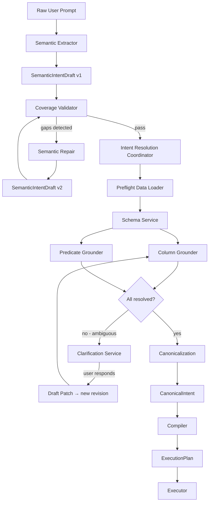
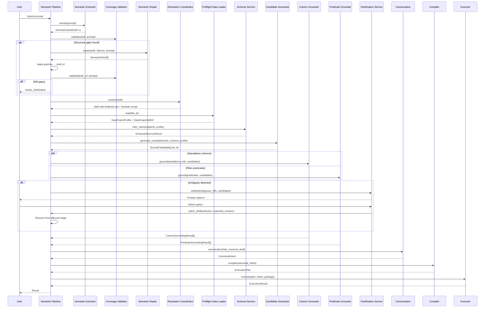
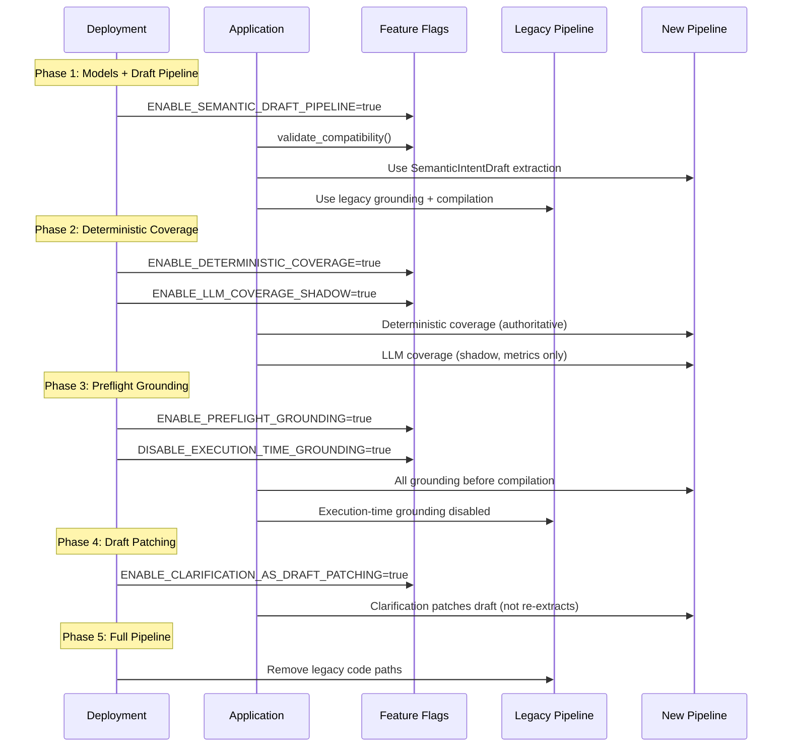

# Design Document: Semantic Grounding Refactor

## Overview

This design describes the refactoring of FinFlow's natural-language interpretation and grounding architecture into a multi-stage pipeline with clearly separated responsibilities. The current architecture suffers from premature semantic commitment, destroyed boolean scope, overlapping column resolution authorities, unreliable LLM-based coverage checking, unbounded repair, and late grounding (during execution).

The refactored architecture introduces:
- **SemanticIntentDraft** as a pre-canonical intermediate representation preserving ambiguity
- **Single decision-ownership** per semantic element via a formal ownership matrix
- **Preflight grounding** completing all column/predicate resolution before compilation
- **Deterministic coverage validation** replacing LLM-authoritative coverage
- **Bounded semantic repair** (one attempt, typed patches only)
- **Layered schema caching** with structural and value-evidence separation
- **Post-LLM verification** with explicit tie-breaking policies

### Design Rationale

The current system conflates extraction, grounding, and compilation into overlapping stages. The `build_canonical_intent()` function in `canonical_intent.py` performs extraction, column grounding, and filter parsing in a single pass. The `column_resolver.py` and `predicate_grounder.py` both resolve columns but with different scoring heuristics and no formal ownership boundary. The refactoring separates these into distinct pipeline stages with explicit contracts between them.

## Architecture

### Multi-Stage Pipeline Architecture

The pipeline processes a user prompt through discrete, ordered stages. Each stage has a single responsibility and communicates via typed contracts.



### Pipeline Stage Ordering

| Stage | Component | LLM? | Authority |
|-------|-----------|------|-----------|
| 1. Extraction | Semantic Extractor | Yes | Produces draft, preserves ambiguity |
| 2. Coverage Validation | Coverage Validator | Shadow only | Structural checks, no semantic re-interpretation |
| 3. Bounded Repair | Semantic Repair | Yes (1 attempt) | Typed patches against declared paths |
| 4. Resolution Coordination | Intent Resolution Coordinator | No | Operation classification, boolean scope |
| 5. Preflight Data Load | Preflight Data Loader | No | File profiling, DataSnapshotRef |
| 6. Schema Inference | Schema Service | Yes (cached) | Column roles, semantic types |
| 7. Column Grounding | Column Grounder | Fallback | Standalone column resolution |
| 8. Predicate Grounding | Predicate Grounder | Fallback | Filter predicate resolution |
| 9. Canonicalization | Pipeline | No | Type-level guarantee: draft→canonical |
| 10. Compilation | Compiler | No | ExecutionPlan generation |
| 11. Execution | Executor | No | Plan walking, zero LLM |

### Decision Ownership Matrix

| Semantic Decision | Owner | Cannot Override |
|-------------------|-------|----------------|
| Operation classification (filter/project/sort/etc.) | Intent Resolution Coordinator | Grounders, Compiler, Executor |
| Boolean scope (AND/OR grouping) | Intent Resolution Coordinator | All downstream |
| Standalone column resolution (projections, sorts, drops, renames) | Column Grounder | Predicate Grounder, Compiler |
| Filter column resolution (field in field+op+value) | Predicate Grounder | Column Grounder, Compiler |
| Canonical operator mapping | Predicate Grounder | Column Grounder, Compiler |
| Predicate value normalization | Predicate Grounder | All others |
| Dataset semantic role | Schema Service | Grounders (use as evidence only) |
| Ambiguous user choice | User via Clarification Service | All components |
| Execution step selection | Compiler | Executor |

### Directory Structure (Shared Grounding Layer)

```
agent-framework/.../src/finflow_agent/
├── grounding/                         # NEW: shared grounding package
│   ├── __init__.py
│   ├── candidate_generator.py         # Shared Candidate Generation Layer
│   ├── scoring.py                     # Token overlap, value-concept, semantic-type scoring
│   ├── evidence.py                    # Evidence models (positive/negative)
│   ├── column_grounder.py             # Column Grounder (standalone refs)
│   ├── predicate_grounder.py          # Predicate Grounder (filter predicates)
│   ├── schema_service.py             # Schema Service with layered cache
│   ├── preflight_loader.py           # Preflight Data Loader
│   ├── llm_adapter.py               # SemanticResolver LLM protocol
│   └── verification.py              # Post-LLM deterministic verification
├── pipeline/                          # NEW: pipeline orchestration
│   ├── __init__.py
│   ├── coordinator.py                 # Intent Resolution Coordinator
│   ├── coverage_validator.py          # Deterministic Coverage Validator
│   ├── semantic_repair.py            # Bounded Semantic Repair
│   ├── canonicalizer.py              # Draft → CanonicalIntent boundary
│   ├── feature_flags.py             # Feature flag system + compatibility matrix
│   └── observability.py             # Structured tracing + metrics
├── models/                            # NEW: shared data models
│   ├── __init__.py
│   ├── draft.py                      # SemanticIntentDraft + SemanticColumnReference
│   ├── canonical.py                  # CanonicalIntent (type-level resolved)
│   ├── provenance.py                 # ProvenanceRef, PromptSpanProvenance, etc.
│   ├── envelope.py                   # IntentEnvelope (draft or canonical + metadata)
│   ├── patches.py                    # SemanticPatch operations
│   ├── fingerprints.py              # Structural/Profile fingerprints
│   └── snapshot.py                   # DataSnapshotRef
├── planning/                          # EXISTING (modified)
│   ├── compiler.py                   # Accepts only CanonicalIntent
│   └── intent_package.py            # Extended with new fields
├── execution/                         # EXISTING (modified)
│   └── engine.py                     # Validates columns, zero LLM
└── tools/                             # EXISTING (legacy, behind feature flags)
    ├── column_resolver.py            # Legacy column resolution
    └── predicate_grounder.py         # Legacy predicate grounding
```

## Components and Interfaces

### SemanticExtractor

Converts raw user prompt into a SemanticIntentDraft. Preserves ambiguity instead of committing to a single interpretation.

```python
class SemanticExtractor(Protocol):
    async def extract(
        self, prompt: str, schema_context: SchemaContext | None = None
    ) -> SemanticIntentDraft:
        """
        Extract semantic intent from raw prompt.
        
        Guarantees:
        - Output is SemanticIntentDraft (never CanonicalIntent)
        - Every extracted element has at least one ProvenanceRef
        - Generic words classified as generic_reference
        - Multiple interpretations preserved as ambiguity markers
        - Boolean scope preserved (value sets not split)
        """
        ...
```

### CoverageValidator

Deterministic structural validation. No semantic re-interpretation.

```python
class CoverageValidator(Protocol):
    def validate(
        self, draft: SemanticIntentDraft, prompt: str
    ) -> CoverageValidationResult:
        """
        Check structural correctness of extracted draft.
        
        Checks:
        - JSON/schema validity
        - Action-to-reference completeness
        - Negation and boolean-group preservation
        - Duplicate/contradictory action detection
        - Unresolved-reference declarations
        - Valid contract tokens
        - Every element linked to at least one ProvenanceRef
        - Every material source span linked to an element or ignored-span
        
        Does NOT:
        - Re-interpret prompt via keyword analysis
        - Make semantic judgments about coverage
        """
        ...

    async def shadow_llm_coverage(
        self, draft: SemanticIntentDraft, prompt: str
    ) -> ShadowComparisonMetric | None:
        """Run LLM coverage in shadow mode (no authority). Returns None if disabled."""
        ...
```

### SemanticRepair

Bounded patch-based repair. Maximum one attempt per invocation.

```python
class SemanticRepair(Protocol):
    async def repair(
        self,
        draft: SemanticIntentDraft,
        failures: list[StructuralFailure],
        prompt: str,
    ) -> list[SemanticPatch]:
        """
        Produce typed patches to fix declared structural failures.
        
        Constraints:
        - Only add/replace/remove operations
        - Only against declared draft paths from validator failures
        - Maximum one attempt per pipeline invocation
        - Returns patches (not a re-extraction)
        """
        ...
```

### SchemaService

Layered caching schema inference. Structural roles cached independently from value evidence.

```python
class SchemaService(Protocol):
    def infer_roles(
        self, snapshot: DataSnapshotRef, profile: DataFrameProfile
    ) -> SchemaInferenceResult:
        """
        Infer column roles and semantic types.
        
        Cache layers:
        - L1: Structural role cache (fingerprint + role-model version)
        - L2: Value-evidence cache (fingerprint + profile fingerprint + profiler version)
        
        Executes during dataset-profiling stage (after Preflight, before grounding).
        """
        ...
```

### CandidateGenerator (Shared Candidate Generation Layer)

Shared by both grounders. Deterministic scoring.

```python
class CandidateGenerator(Protocol):
    def generate_candidates(
        self,
        reference: SemanticColumnReference,
        schema_result: SchemaInferenceResult,
        profile: DataFrameProfile,
    ) -> list[ScoredCandidate]:
        """
        Generate scored column candidates for a semantic reference.
        
        Scoring dimensions:
        - Token overlap
        - Value-concept matching
        - Semantic-type alignment
        - Column-name similarity
        
        Guarantees:
        - Identical inputs → identical scores
        - Exposes positive + negative evidence per candidate
        """
        ...
```

### ColumnGrounder

Resolves standalone column references (projections, sorts, drops, renames).

```python
class ColumnGrounder(Protocol):
    async def ground(
        self,
        references: list[SemanticColumnReference],
        candidates_by_ref: dict[str, list[ScoredCandidate]],
        config: GroundingConfig,
    ) -> list[ColumnGroundingResult]:
        """
        Resolve standalone column references.
        
        Does NOT resolve filter predicate columns.
        Uses Candidate Generation Layer for scoring.
        LLM fallback constrained to existing physical columns.
        Post-LLM verification required before accepting.
        """
        ...
```

### PredicateGrounder

Resolves complete filter predicates (field + operator + value).

```python
class PredicateGrounder(Protocol):
    async def ground(
        self,
        predicates: list[UnresolvedPredicate],
        candidates_by_ref: dict[str, list[ScoredCandidate]],
        config: GroundingConfig,
    ) -> list[PredicateGroundingResult]:
        """
        Resolve filter predicates including column, operator, and value.
        
        Owns: filter column resolution, operator mapping, value normalization.
        Does NOT delegate filter-column decisions to Column Grounder.
        Uses Candidate Generation Layer for column scoring.
        LLM fallback constrained to existing physical columns.
        Post-LLM verification required before accepting.
        """
        ...
```

### IntentResolutionCoordinator

Finalizes operation classification and boolean scope. Single owner of these decisions.

```python
class IntentResolutionCoordinator(Protocol):
    def resolve(
        self, draft: SemanticIntentDraft
    ) -> SemanticIntentDraft:
        """
        Finalize operation classification and boolean scope.
        
        - Receives operation candidates from extraction
        - Applies deterministic validation results
        - Applies user clarification patches
        - Selects unique operation when supported
        - Preserves unresolved ambiguity otherwise
        - Returns updated draft with finalized action type and logical-group structure
        """
        ...
```

### Compiler

Deterministic transformation of CanonicalIntent → ExecutionPlan.

```python
class Compiler(Protocol):
    def compile(
        self, intent: CanonicalIntent, intent_package: IntentPackage
    ) -> ExecutionPlan:
        """
        Compile canonical intent into execution plan.
        
        Preconditions (type-level guarantees):
        - Input is CanonicalIntent (always resolved)
        - Every column reference resolved to physical column
        
        Does NOT: perform grounding, make LLM calls, re-interpret semantics.
        """
        ...
```

### Executor

Walks an ExecutionPlan. Zero LLM, zero grounding.

```python
class Executor(Protocol):
    def execute(
        self, plan: ExecutionPlan, intent_package: IntentPackage
    ) -> ExecutionResult:
        """
        Execute plan steps.
        
        Validates every referenced column exists in intent package.
        Verifies content_hash matches DataSnapshotRef.
        Fail-closed on any column not in validated package.
        Zero LLM calls. Zero grounding. Zero semantic interpretation.
        """
        ...
```

### SemanticResolver (LLM Adapter Protocol)

Unified protocol for all LLM call sites with bounded behavior.

```python
class SemanticResolver(Protocol):
    """LLM adapter with explicit constraints per call site."""

    async def call(
        self,
        messages: list[dict[str, str]],
        *,
        call_site: LLMCallSite,
        constraint: LLMConstraint,
        timeout: float = 30.0,
    ) -> LLMResponse:
        """
        Make an LLM call with site-specific constraints.
        
        call_site: Identifies which component is calling (for metrics/tracing)
        constraint: Defines output schema, allowed operations, retry policy
        """
        ...
```

### ClarificationService Integration

The existing `ClarificationService` (from interactive-ambiguity-resolution spec) is extended to support draft patching:

```python
class DraftPatchingMixin:
    """Extension to ClarificationService for SemanticIntentDraft patching."""

    async def patch_draft(
        self,
        draft: SemanticIntentDraft,
        user_selection: ClarificationResponse,
        expected_revision: int,
    ) -> SemanticIntentDraft:
        """
        Apply user clarification as a draft patch.
        
        - Validates expected_revision matches current
        - Produces new immutable draft revision
        - Records ClarificationProvenance
        - Returns stage-resume directive
        
        Raises StaleRevisionError if revision mismatch.
        """
        ...
```

## Data Models

### SemanticIntentDraft (Pre-Canonical Model)

```python
from __future__ import annotations
from datetime import datetime, timezone
from enum import Enum
from typing import Annotated, Any, Literal, Union
from pydantic import BaseModel, Field, ConfigDict

class ReferenceKind(str, Enum):
    EXPLICIT_NAME = "explicit_name"
    SEMANTIC_CONCEPT = "semantic_concept"
    GENERIC_REFERENCE = "generic_reference"
    VALUE_IMPLIED = "value_implied"
    COLUMN_GROUP = "column_group"

class ResolutionStatus(str, Enum):
    PENDING = "pending"
    NEEDS_CLARIFICATION = "needs_clarification"
    INTERPRETATION_FAILED = "interpretation_failed"
    UNSUPPORTED = "unsupported"
    INVALID = "invalid"
    RESOLVED = "resolved"

class ResolutionOrigin(str, Enum):
    DIRECT = "direct"
    SEMANTIC_REPAIR = "semantic_repair"
    AUTOMATIC_GROUNDING = "automatic_grounding"
    USER_CLARIFICATION = "user_clarification"

# --- Provenance Types ---

class PromptSpanProvenance(BaseModel):
    model_config = ConfigDict(strict=True)
    type: Literal["prompt_span"] = "prompt_span"
    start_offset: int  # Unicode code-point offset
    end_offset: int
    source_text: str

class ClarificationProvenance(BaseModel):
    model_config = ConfigDict(strict=True)
    type: Literal["clarification"] = "clarification"
    question_id: str
    response_id: str
    selected_value: str

class SchemaEvidenceProvenance(BaseModel):
    model_config = ConfigDict(strict=True)
    type: Literal["schema_evidence"] = "schema_evidence"
    schema_fingerprint: str
    column: str
    evidence: list[str]

ProvenanceRef = Annotated[
    Union[PromptSpanProvenance, ClarificationProvenance, SchemaEvidenceProvenance],
    Field(discriminator="type"),
]
```

### SemanticColumnReference and Draft Actions

```python
class SemanticColumnReference(BaseModel):
    model_config = ConfigDict(strict=True)
    reference_text: str
    reference_kind: ReferenceKind
    resolved_column: str | None = None
    confidence: float | None = None
    provenance: list[ProvenanceRef] = Field(min_length=1)

class AmbiguityMarker(BaseModel):
    element_path: str
    candidates: list[str]
    provenance: list[ProvenanceRef]

class LogicalGroup(BaseModel):
    operator: Literal["and", "or"]
    predicates: list["UnresolvedPredicate"]
    provenance: list[ProvenanceRef]

class UnresolvedPredicate(BaseModel):
    field_ref: SemanticColumnReference
    operator: str
    value: Any
    negated: bool = False
    provenance: list[ProvenanceRef]

# Discriminated action union
class FilterAction(BaseModel):
    type: Literal["filter"] = "filter"
    logical_groups: list[LogicalGroup]
    provenance: list[ProvenanceRef]

class ProjectAction(BaseModel):
    type: Literal["project"] = "project"
    columns: list[SemanticColumnReference]
    provenance: list[ProvenanceRef]

class DropAction(BaseModel):
    type: Literal["drop"] = "drop"
    columns: list[SemanticColumnReference]
    provenance: list[ProvenanceRef]

class SortAction(BaseModel):
    type: Literal["sort"] = "sort"
    keys: list[SemanticColumnReference]
    directions: list[Literal["asc", "desc"]]
    provenance: list[ProvenanceRef]

class RenameAction(BaseModel):
    type: Literal["rename"] = "rename"
    mappings: list[tuple[SemanticColumnReference, str]]
    provenance: list[ProvenanceRef]

# ... additional action types follow same pattern

DraftAction = Annotated[
    Union[FilterAction, ProjectAction, DropAction, SortAction, RenameAction],
    Field(discriminator="type"),
]
```

### SemanticIntentDraft (Complete Model)

```python
class SemanticIntentDraft(BaseModel):
    model_config = ConfigDict(strict=True)
    
    # Versioning
    schema_version: str = "1.0"
    draft_id: str = Field(default_factory=lambda: str(uuid4()))
    draft_revision: int = 1  # Monotonically incrementing
    
    # Content
    raw_prompt: str
    actions: list[DraftAction]
    ambiguities: list[AmbiguityMarker] = Field(default_factory=list)
    ignored_spans: list[PromptSpanProvenance] = Field(default_factory=list)
    
    # Resolution state
    resolution_status: ResolutionStatus = ResolutionStatus.PENDING
    resolution_origin: ResolutionOrigin | None = None
    
    # Provenance
    extraction_provenance: list[ProvenanceRef] = Field(default_factory=list)
    
    # Metadata
    created_at: datetime = Field(default_factory=lambda: datetime.now(timezone.utc))
    data_snapshot_ref: DataSnapshotRef | None = None
    
    # Resolution history (immutable audit trail)
    resolution_history: list[ResolutionRecord] = Field(default_factory=list)
```

### CanonicalIntent (Type-Level Resolved Guarantee)

```python
class CanonicalIntent(BaseModel):
    """
    Fully resolved, executable intent.
    Can only be constructed from a resolved SemanticIntentDraft.
    Contains no unresolved active execution references.
    """
    model_config = ConfigDict(strict=True, frozen=True)
    
    intent_id: str = Field(default_factory=lambda: str(uuid4()))
    schema_version: str = "1.0"
    
    # Always resolved
    resolution_status: Literal["resolved"] = "resolved"
    resolution_origin: ResolutionOrigin
    
    # Resolved content (all columns are physical)
    actions: list[ResolvedAction]
    
    # Immutable audit fields (historical metadata, not active references)
    source_draft_id: str
    source_draft_revision: int
    resolution_history: list[ResolutionRecord] = Field(default_factory=list)
    provenance: list[ProvenanceRef] = Field(default_factory=list)
    
    # Data context
    data_snapshot_ref: DataSnapshotRef
    
    created_at: datetime = Field(default_factory=lambda: datetime.now(timezone.utc))

    @classmethod
    def from_resolved_draft(cls, draft: SemanticIntentDraft) -> "CanonicalIntent":
        """
        Factory: only constructs if draft.resolution_status == RESOLVED
        and all references are grounded.
        Raises CanonicalizeError otherwise.
        """
        if draft.resolution_status != ResolutionStatus.RESOLVED:
            raise CanonicalizeError(
                f"Cannot canonicalize draft with status {draft.resolution_status}"
            )
        # ... validate all references resolved, construct canonical
        ...
```

### Evidence and Scoring Models

```python
class ScoredCandidate(BaseModel):
    """A column candidate with deterministic scoring breakdown."""
    column_name: str
    total_score: float = Field(ge=0.0, le=1.0)
    token_overlap_score: float = Field(ge=0.0, le=1.0)
    value_concept_score: float = Field(ge=0.0, le=1.0)
    semantic_type_score: float = Field(ge=0.0, le=1.0)
    name_similarity_score: float = Field(ge=0.0, le=1.0)
    positive_evidence: list[str]
    negative_evidence: list[str]

class GroundingConfig(BaseModel):
    confidence_threshold: float = 0.75
    ambiguity_margin: float = 0.1
    llm_fallback_enabled: bool = True
    destructive_action_extra_caution: bool = True
```

### Fingerprint Models

```python
class StructuralSchemaFingerprint(BaseModel):
    """Deterministic hash of dataset structural schema."""
    fingerprint: str  # SHA-256 hex
    column_names: list[str]  # Normalized, ordered
    column_dtypes: list[str]
    nullable: list[bool]
    profiler_version: str

    @classmethod
    def compute(cls, columns: list[str], dtypes: list[str], 
                nullable: list[bool], profiler_version: str) -> "StructuralSchemaFingerprint":
        """Compute deterministic fingerprint from structural schema."""
        ...

class ProfileFingerprint(BaseModel):
    """Deterministic hash of semantic statistics (no raw values)."""
    fingerprint: str  # SHA-256 hex
    cardinality_buckets: list[int]
    representative_value_hashes: list[str]
    profiling_config_version: str

class DataSnapshotRef(BaseModel):
    """Immutable reference to a profiled file version."""
    file_id: str
    content_hash: str
    byte_size: int
    storage_version: str
    profile_id: str
    structural_schema_fingerprint: str
    profile_fingerprint: str
```

### SemanticPatch Operations

```python
class PatchOp(str, Enum):
    ADD = "add"
    REPLACE = "replace"
    REMOVE = "remove"

class SemanticPatch(BaseModel):
    """Typed operation applied against a declared draft path."""
    operation: PatchOp
    path: str  # JSON-path-like reference into draft
    value: Any = None  # For add/replace
    reason: str
    provenance: list[ProvenanceRef] = Field(default_factory=list)
    source_failure: str  # Which validator failure triggered this
```

### IntentEnvelope

```python
class PipelineStatus(str, Enum):
    PROCESSING = "processing"
    NEEDS_CLARIFICATION = "needs_clarification"
    INTERPRETATION_FAILED = "interpretation_failed"
    UNSUPPORTED = "unsupported"
    INVALID = "invalid"
    RESOLVED = "resolved"

class IntentEnvelope(BaseModel):
    """Container tracking pipeline state."""
    submission_id: str
    pipeline_status: PipelineStatus
    current_stage: str
    
    # Holds either draft or canonical (never both)
    draft: SemanticIntentDraft | None = None
    canonical: CanonicalIntent | None = None
    
    # Metadata
    model_version: str
    feature_flags: dict[str, bool]
    created_at: datetime
    updated_at: datetime
```

### Resolution Records

```python
class ResolutionRecord(BaseModel):
    """Audit record for a resolution decision."""
    timestamp: datetime
    stage: str
    decision_owner: str
    element_path: str
    resolution: str
    confidence: float
    evidence: list[str]
    provenance: list[ProvenanceRef]

class ShadowComparisonMetric(BaseModel):
    """Comparison between deterministic and LLM coverage results."""
    deterministic_result: bool
    llm_result: bool | None
    agreement_status: Literal["agree", "disagree", "llm_unavailable"]
    deterministic_gaps: list[str]
    llm_gaps: list[str]
```

### Feature Flag System

```python
class FeatureFlags(BaseModel):
    """Pipeline feature flags with compatibility validation."""
    ENABLE_SEMANTIC_DRAFT_PIPELINE: bool = False
    ENABLE_PREFLIGHT_GROUNDING: bool = False
    DISABLE_EXECUTION_TIME_GROUNDING: bool = False
    ENABLE_LLM_COVERAGE_SHADOW: bool = False
    ENABLE_DETERMINISTIC_COVERAGE: bool = True
    ENABLE_BOUNDED_REPAIR: bool = False
    ENABLE_SCHEMA_CACHING: bool = False
    ENABLE_CLARIFICATION_AS_DRAFT_PATCHING: bool = False

    COMPATIBILITY_RULES: ClassVar[list[tuple[str, str, str]]] = [
        # (if_flag, requires_flag, error_message)
        ("ENABLE_PREFLIGHT_GROUNDING", "DISABLE_EXECUTION_TIME_GROUNDING",
         "Preflight grounding requires execution-time grounding disabled"),
        ("ENABLE_CLARIFICATION_AS_DRAFT_PATCHING", "ENABLE_SEMANTIC_DRAFT_PIPELINE",
         "Draft patching requires semantic draft pipeline"),
        ("ENABLE_LLM_COVERAGE_SHADOW", "ENABLE_DETERMINISTIC_COVERAGE",
         "LLM shadow requires deterministic coverage enabled"),
    ]

    def validate_compatibility(self) -> list[str]:
        """Returns list of errors. Empty = valid."""
        errors = []
        for if_flag, requires_flag, msg in self.COMPATIBILITY_RULES:
            if getattr(self, if_flag) and not getattr(self, requires_flag):
                errors.append(msg)
        return errors
```

### LLM Adapter and Tie-Breaking Policy

```python
class LLMCallSite(str, Enum):
    EXTRACTION = "extraction"
    REPAIR = "repair"
    SCHEMA_INFERENCE = "schema_inference"
    COLUMN_GROUNDING = "column_grounding"
    PREDICATE_GROUNDING = "predicate_grounding"
    COVERAGE_SHADOW = "coverage_shadow"

class TieBreakingPolicy(str, Enum):
    """Post-LLM tie-breaking disposition."""
    RESOLVE = "resolve"          # LLM agrees with strong deterministic leader
    CLARIFY = "clarify"          # Ambiguous - ask user
    REJECT = "reject"            # LLM conflicts with deterministic evidence

class PostLLMVerification(BaseModel):
    """Result of post-LLM deterministic verification."""
    candidate_exists: bool
    operator_compatible: bool
    value_shape_valid: bool
    dtype_compatible: bool
    in_permitted_set: bool
    tie_breaking_result: TieBreakingPolicy
    
    @property
    def passed(self) -> bool:
        return all([
            self.candidate_exists,
            self.operator_compatible,
            self.value_shape_valid,
            self.dtype_compatible,
            self.in_permitted_set,
            self.tie_breaking_result == TieBreakingPolicy.RESOLVE,
        ])

def apply_tie_breaking_policy(
    llm_selection: str,
    deterministic_leader: ScoredCandidate | None,
    runner_up: ScoredCandidate | None,
    ambiguity_margin: float,
    is_destructive: bool,
) -> TieBreakingPolicy:
    """
    Tie-breaking rules:
    1. LLM agrees with strong deterministic leader (margin > ambiguity_margin) → RESOLVE
    2. LLM is only evidence breaking a close tie (within margin) → CLARIFY
    3. LLM conflicts with deterministic leader → CLARIFY
    4. Destructive operation with close candidates → CLARIFY regardless
    """
    if deterministic_leader is None:
        return TieBreakingPolicy.CLARIFY
    
    margin = (deterministic_leader.total_score - 
              (runner_up.total_score if runner_up else 0.0))
    
    if is_destructive and margin < ambiguity_margin:
        return TieBreakingPolicy.CLARIFY
    
    if llm_selection == deterministic_leader.column_name:
        if margin > ambiguity_margin:
            return TieBreakingPolicy.RESOLVE
        else:
            return TieBreakingPolicy.CLARIFY
    else:
        return TieBreakingPolicy.CLARIFY
```

### Pipeline Flow: Complete Sequence



### Migration Sequence



## Correctness Properties

*A property is a characteristic or behavior that should hold true across all valid executions of a system — essentially, a formal statement about what the system should do. Properties serve as the bridge between human-readable specifications and machine-verifiable correctness guarantees.*

### Property 1: SemanticIntentDraft Serialization Round-Trip

*For any* valid `SemanticIntentDraft` object (including all action variants, provenance types, and resolution statuses), serializing via `model_dump(mode="json")` then deserializing via `model_validate()` SHALL produce an equivalent object with no data loss or silent coercion.

**Validates: Requirements 14.1, 14.2, 14.3, 14.5**

### Property 2: Provenance Completeness Invariant

*For any* valid `SemanticIntentDraft`, every extracted semantic element (action, reference, operator, value, logical group, exclusion) SHALL have at least one `ProvenanceRef` entry, and every material source span SHALL be linked to at least one semantic element, ambiguity record, or explicitly ignored-span record.

**Validates: Requirements 1.6, 3.2, 15.1, 15.2, 15.3**

### Property 3: Single Decision-Owner Routing

*For any* semantic column reference with a known context (standalone projection/sort/drop/rename vs. filter predicate field), the pipeline routing logic SHALL assign it to exactly one grounder — Column Grounder for standalone references, Predicate Grounder for filter predicates — and SHALL reject the reference if presented to the wrong grounder.

**Validates: Requirements 2.3, 2.4, 2.5, 8.4, 8.5**

### Property 4: Finalized Resolution Immutability

*For any* semantic element whose Decision_Owner has finalized a resolution, any subsequent override attempt by a different component SHALL be rejected, and the original resolution SHALL remain unchanged.

**Validates: Requirements 2.6**

### Property 5: Bounded Repair Constraint

*For any* pipeline invocation where the Coverage Validator detects structural gaps, Semantic Repair SHALL execute at most one attempt and SHALL return only typed `SemanticPatch` operations (add, replace, remove) against declared paths. If gaps remain after one repair, the pipeline SHALL set status to `needs_clarification`.

**Validates: Requirements 4.1, 4.2, 4.3, 4.5**

### Property 6: Patch Application Produces New Revision

*For any* valid `SemanticIntentDraft` at revision N and any valid list of `SemanticPatch` operations, applying the patches SHALL produce a new `SemanticIntentDraft` at revision N+1 with the patches applied deterministically, while the original draft at revision N remains unmodified.

**Validates: Requirements 4.4, 17.1**

### Property 7: Schema Cache Determinism

*For any* two schema inference requests with identical `StructuralSchemaFingerprint` and role-model version (for structural roles) or identical structural + profile fingerprint (for value evidence), the Schema Service SHALL return identical results. Different structural schemas SHALL produce different fingerprints.

**Validates: Requirements 5.1, 5.2, 5.3, 5.4, 8.3**

### Property 8: Candidate Scoring Determinism

*For any* `SemanticColumnReference`, `SchemaInferenceResult`, and `DataFrameProfile`, the Candidate Generation Layer SHALL produce identical scored candidates with identical positive and negative evidence — regardless of call order or which grounder invokes it.

**Validates: Requirements 7.2, 7.3, 7.4**

### Property 9: Tie-Breaking Policy Correctness

*For any* combination of LLM selection, deterministic leader score, runner-up score, ambiguity margin, and destructive-action flag, the tie-breaking function SHALL produce:
- `RESOLVE` only when LLM agrees with strong deterministic leader (margin > ambiguity_margin) AND operation is not destructive with close candidates
- `CLARIFY` when LLM is the only evidence breaking a close tie, when LLM conflicts with deterministic leader, or when destructive operation has close candidates

**Validates: Requirements 8.9**

### Property 10: Post-LLM Verification Gate

*For any* LLM fallback selection, the pipeline SHALL apply all verification checks (candidate exists, operator compatible, value shape valid, dtype compatible, in permitted set, tie-breaking policy). If any check fails, the pipeline SHALL route to Clarification Service rather than accepting the LLM result.

**Validates: Requirements 8.7, 8.8**

### Property 11: Canonicalization Type-Level Guarantee

*For any* `SemanticIntentDraft` with `resolution_status` != `"resolved"` or with any unresolved active column references, `CanonicalIntent.from_resolved_draft()` SHALL raise an error. *For any* `CanonicalIntent` successfully constructed, it SHALL be accepted by the Compiler regardless of its `resolution_origin`.

**Validates: Requirements 6.2, 11.2, 20.2, 20.4, 21.2, 21.4**

### Property 12: Executor Boundary Contract

*For any* `ExecutionPlan` step referencing a column not present in the validated `IntentPackage`, the Executor SHALL return a fail-closed error without executing the step. The Executor SHALL make zero LLM calls, zero grounding operations, and zero semantic interpretations.

**Validates: Requirements 6.3, 8.6, 11.3, 11.4, 11.5**

### Property 13: Uncertainty Resolution Policy

*For any* grounding result where multiple candidates fall within the `ambiguity_margin`, or confidence is below `confidence_threshold`, or operation classification is ambiguous, the pipeline SHALL route to Clarification Service. Low-confidence resolution SHALL never proceed to execution with only a warning.

**Validates: Requirements 6.5, 10.2, 10.3, 10.4, 10.6**

### Property 14: Feature-Flag Compatibility Validation

*For any* feature-flag configuration, the compatibility validator SHALL detect all invalid combinations (preflight without disabling execution-time grounding; draft patching without draft pipeline; LLM shadow without deterministic coverage) and SHALL reject them at startup with descriptive errors. No mixed mode where both legacy and new grounding are active for the same reference type SHALL be permitted.

**Validates: Requirements 13.3, 13.6, 19.1, 19.2, 19.3, 19.4, 19.5**

### Property 15: Stale Revision Rejection

*For any* clarification patch request where `expected_revision` differs from the current `draft_revision`, the Clarification Service SHALL reject the response as stale. *For any* duplicate `idempotency_key`, the second application SHALL be rejected or treated as no-op.

**Validates: Requirements 17.2, 17.3, 17.4**

### Property 16: LLM Failure Classification

*For any* LLM provider failure (timeout, rate limit, invalid JSON, schema validation failure, empty output, or provider outage) at the extraction stage, the pipeline SHALL set `Pipeline_Status` to `interpretation_failed` — never `needs_clarification`. Provider failure and genuine user ambiguity SHALL always be distinguished.

**Validates: Requirements 18.1, 18.6**

### Property 17: Content Hash Consistency Enforcement

*For any* execution where the file `content_hash` at execution time differs from the `DataSnapshotRef.content_hash` established during preflight, the Executor SHALL fail closed with a data-consistency error and SHALL NOT proceed with execution.

**Validates: Requirements 16.3, 16.4**

### Property 18: Canonical Intent Immutability

*For any* `CanonicalIntent` object (constructed with `frozen=True`), any attempt to mutate the semantic action type, logical grouping, or resolved column references SHALL raise an error. The model SHALL be immutable after construction.

**Validates: Requirements 21.5**

### Property 19: Draft Schema Version Rejection

*For any* `SemanticIntentDraft` JSON payload with a `schema_version` greater than the current supported version, the pipeline SHALL reject it with a version-incompatibility error rather than silently processing it.

**Validates: Requirements 14.4**

### Property 20: Clarification Produces ClarificationProvenance

*For any* user clarification response that patches a draft, the resulting draft revision SHALL contain a `ClarificationProvenance` entry (with `question_id`, `response_id`, and `selected_value`) rather than a synthetic `PromptSpanProvenance`.

**Validates: Requirements 15.5, 9.2**

### Property 21: Legacy Upcaster Round-Trip

*For any* valid legacy `CanonicalIntent` payload (pre-refactor schema), the versioned upcaster SHALL produce a valid new-schema `CanonicalIntent` object that preserves all semantic meaning from the original payload.

**Validates: Requirements 13.4**

## Error Handling

### Error Categories and Responses

| Error Type | Component | Response | Status |
|-----------|-----------|----------|--------|
| LLM provider timeout/outage (extraction) | Semantic Extractor | Retry with bounded policy, then `interpretation_failed` | `interpretation_failed` |
| LLM invalid JSON / schema failure | Semantic Extractor | Retry once, then `interpretation_failed` | `interpretation_failed` |
| LLM provider failure (schema) | Schema Service | Return cached result or deterministic-only | Continue |
| LLM provider failure (grounding) | Column/Predicate Grounder | Route to Clarification with deterministic candidates | `needs_clarification` |
| LLM provider failure (repair) | Semantic Repair | Route to Clarification with original gap | `needs_clarification` |
| LLM shadow mode failure | Coverage Validator | No impact, continue pipeline | Continue |
| Structural coverage gap (first) | Coverage Validator | Route to Semantic Repair | Continue |
| Structural coverage gap (after repair) | Coverage Validator | `needs_clarification` | `needs_clarification` |
| Low-confidence grounding | Grounders | Route to Clarification | `needs_clarification` |
| Ambiguous operation | Resolution Coordinator | Route to Clarification | `needs_clarification` |
| Stale revision on clarification | Clarification Service | Reject, present updated state | Error response |
| Duplicate idempotency_key | Clarification Service | No-op, return current state | Continue |
| Unsupported schema version | Pipeline | Reject with version error | `invalid` |
| Contract violation (unresolved ref at compile) | Compiler | Fail closed | `invalid` |
| Column not in intent package (execution) | Executor | Fail closed, no execution | Error |
| Content hash mismatch | Executor | Fail closed, data-consistency error | Error |
| File exceeds size limit | Preflight Data Loader | Reject before profiling | Error |
| Invalid feature-flag combination | Startup | Log conflicting flags, terminate non-zero | Startup failure |

### Retry Policies

```python
class RetryPolicy(BaseModel):
    """Bounded retry configuration per LLM call site."""
    max_retries: int = 2
    base_delay_seconds: float = 1.0
    max_delay_seconds: float = 10.0
    backoff_factor: float = 2.0
    retryable_errors: list[str] = ["timeout", "rate_limit", "server_error"]
    
    # Non-retryable: invalid_json → fail immediately after one parse attempt
    # Non-retryable: schema_validation → fail immediately
```

### Graceful Degradation Hierarchy

1. **Extraction fails** → `interpretation_failed` (system error, not user's fault)
2. **Repair fails** → `needs_clarification` (surface gap to user)
3. **Grounding LLM fails** → Clarification with deterministic-only candidates
4. **Schema LLM fails** → Cache hit or deterministic profiling only
5. **Shadow mode fails** → Silent continue (no production impact)

## Testing Strategy

### Dual Testing Approach

This feature uses both property-based tests and example-based unit tests for comprehensive coverage.

**Property-Based Testing Library:** `hypothesis` (Python)

### Property-Based Tests

Each correctness property maps to a single property-based test with minimum 100 iterations. Tests are tagged with:

```
Feature: semantic-grounding-refactor, Property {N}: {title}
```

**Key PBT areas:**

1. **SemanticIntentDraft serialization round-trip** (Property 1) — Generate arbitrary valid drafts with all action variants, provenance types, nested structures. Verify `model_validate(model_dump(mode="json"))` equality.

2. **Tie-breaking policy** (Property 9) — Generate all combinations of scores, margins, destructive flags. Verify deterministic disposition matches rules.

3. **Feature-flag compatibility** (Property 14) — Generate all 2^8 flag combinations. Verify invalid ones are caught, valid ones pass.

4. **Patch application revision invariant** (Property 6) — Generate random drafts and patch sets. Verify revision increments, original unchanged.

5. **Candidate scoring determinism** (Property 8) — Generate random references and profiles. Verify same input → same output across multiple calls.

6. **Content hash enforcement** (Property 17) — Generate file snapshots with matching/mismatching hashes. Verify fail-closed behavior.

7. **Stale revision rejection** (Property 15) — Generate patch requests with various revision numbers. Verify rejection when mismatched.

8. **Canonicalization guard** (Property 11) — Generate drafts with various statuses and unresolved references. Verify only fully-resolved drafts canonicalize.

### Example-Based Unit Tests

- Specific ambiguous prompts → ambiguity markers produced (Req 1.4)
- Decision ownership matrix matches spec (Req 2.2)
- Shadow mode LLM result has no pipeline authority (Req 3.4)
- Formatting uncertainty → warning + proceed (Req 10.1)
- Pretty-printer output contains expected structural elements (Req 14.7)
- Stage ordering verification (Req 5.5, 6.1, 6.4, 16.1)

### Integration Tests

- End-to-end pipeline: prompt → CanonicalIntent → ExecutionPlan → result
- Feature flag toggle: legacy → new behavior transition
- Clarification flow: ambiguity → WebSocket → user response → resume
- Schema cache: hit/miss behavior across structural changes
- LLM failure degradation: provider outage → correct fallback path

### Test Configuration

```python
# conftest.py
from hypothesis import settings, Phase

settings.register_profile(
    "ci",
    max_examples=200,
    phases=[Phase.explicit, Phase.generate, Phase.target, Phase.shrink],
)
settings.register_profile(
    "dev",
    max_examples=100,
)
```

### Coverage Goals

- All 21 correctness properties covered by PBT
- All edge cases from prework covered by unit tests
- Integration tests cover stage transitions and failure paths
- Observability assertions in integration tests (metrics emitted, trace fields present)

